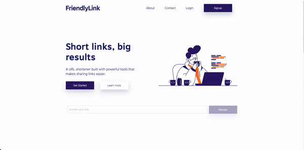

# FriendlyLink: About the Project
FriendlyLink is a URL management platform that is made up of a frontend React web app and a backend Express JS server. 

[Click here to try out the current deployed version](https://frnd.link/)

## Motivation For Project
This project serves as my first fullstack project, and a learning experience in using cloud services like [DigitalOcean](https://www.digitalocean.com/). Furthermore, there was emphasis on using CI/CD tools like Travis in order to effortlessly integrate and deliver code to production.

## Built With
* [Create React App](https://create-react-app.dev/)
* [React JS](https://reactjs.org/)
* [Typescript](https://www.typescriptlang.org/)
* [Ant Design](https://ant.design/)
* [Styled-Components](https://styled-components.com/)
* [Auth0](https://auth0.com/)
* [Axios](https://axios-http.com/)
* [Express JS](https://expressjs.com/)
* [node-posgres](https://node-postgres.com/)
* [Jest](https://jestjs.io/)

## Deployed Using
* [DigitalOcean](https://www.digitalocean.com/)
* [Nginx](https://www.nginx.com/)
* [Travis CI](https://www.travis-ci.com/)

## Frontend Web App
Used Create React App, components written in React and Typescript, and styled using styled-components. Authentication and Account User Management handled using Auth0.

### Landing Page

### User Dashboard

## Backend Server
Used Express JS framework, connects to postgresql database using node-postgres module. API thoroughly tested using Jest.

## Features

### Shorten URL
Shorten a super long URL into a friendly, easy to share link.

### Clicks Visualized
The number of clicks on any shortened link is recorded and visualized in a graph for users to spot trends. (Feature available for account users only)

### Lock Links
Set a password to a shortened link to control who has access to the URL. (Feature available for account users only)

## Challenges Faced
As I have had prior experience building node apps and working on API services, the technical aspect was not the biggest challenge. However, the main huddle I had to face in this project was putting things together - learning how to integrate CI/CD tools like Travis and learning how to deploy both the frontend and backend components of the system took a fair amount of time to research and debug. But it was worth it as I've gained knowledge and experience using cloud computing services that will undoubtedly add value to my future SE projects.